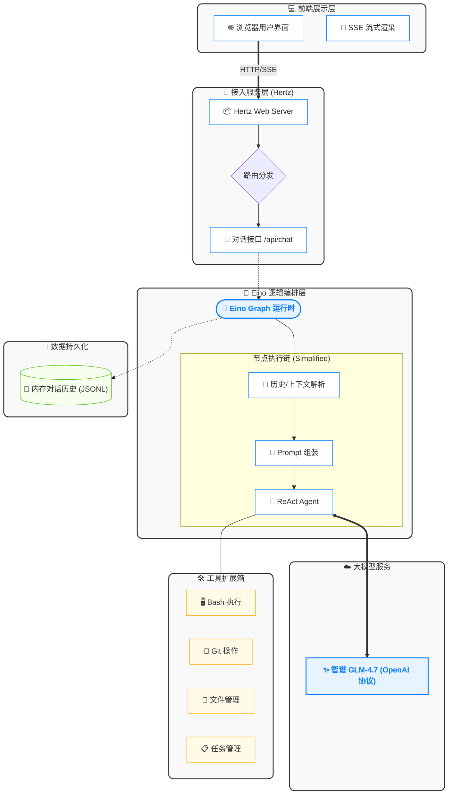

```mermaid
graph TD
    %% 样式定义
    classDef layerStyle fill:#f9f9f9,stroke:#333,stroke-width:2px,rx:10,ry:10;
    classDef nodeStyle fill:#fff,stroke:#007bff,stroke-width:1px,color:#333;
    classDef activeStyle fill:#e7f3ff,stroke:#007bff,stroke-width:2px,color:#007bff,font-weight:bold;
    classDef toolStyle fill:#fffbe6,stroke:#faad14,stroke-width:1px;
    classDef dbStyle fill:#f6ffed,stroke:#52c41a,stroke-width:1px;

    subgraph UI_Layer ["💻 前端展示层"]
        direction LR
        UI["🌐 浏览器用户界面"]
        SSE["📡 SSE 流式渲染"]
    end

    subgraph API_Layer ["🚀 接入服务层 (Hertz)"]
        direction TB
        Hertz["📦 Hertz Web Server"]
        Router{"路由分发"}
        ChatAPI["💬 对话接口 /api/chat"]

        
        Hertz --> Router
        Router --> ChatAPI
    end

    subgraph Core_Layer ["🧠 Eino 逻辑编排层"]
        direction TB
        Graph(["💠 Eino Graph 运行时"])
        
        subgraph Nodes ["节点执行链 (Simplified)"]
            N1["📝 历史/上下文解析"]
            N3["🎨 Prompt 组装"]
            N4["🤖 ReAct Agent"]
            
            N1 --> N3 --> N4
        end
        Graph --- Nodes
    end

    subgraph Model_Layer ["☁️ 大模型服务"]
        direction LR
        GLM["✨ 智谱 GLM-4.7 (OpenAI 协议)"]
    end

    subgraph Storage_Layer ["💾 数据持久化"]
        Mem[("🧠 内存对话历史 (JSONL)")]
    end

    subgraph Tools_Layer ["🛠️ 工具扩展箱"]
        direction LR
        Bash["🖥️ Bash 执行"]
        Git["🐙 Git 操作"]
        File["📂 文件管理"]
        Task["📋 任务管理"]
    end

    %% 连接线
    UI ==>|HTTP/SSE| Hertz
    ChatAPI -.-> Graph
    
    N4 <==> GLM
    Graph -.-> Mem
    N4 --- Tools_Layer
    
    %% 样式映射
    class UI_Layer,API_Layer,Core_Layer,Model_Layer,Storage_Layer,Tools_Layer layerStyle;
    class UI,SSE,Hertz,ChatAPI,N1,N3,N4 nodeStyle;
    class Graph,GLM activeStyle;
    class Bash,Git,File,Task toolStyle;
    class Mem dbStyle;
```